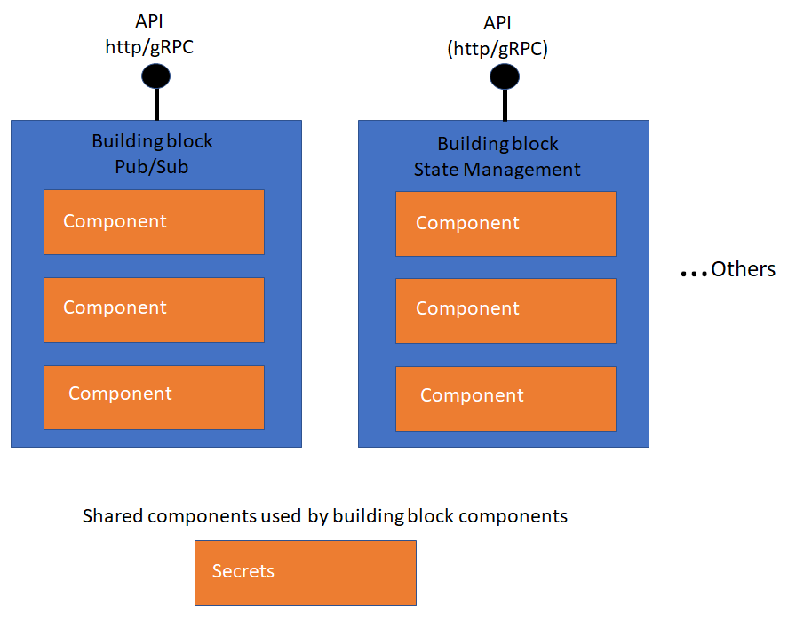

> 备注：内容来自 https://github.com/dapr/docs/tree/master/concepts

### 构建块

构建块以 HTTP 或 gRPC 方式提供API，可以从用户代码调用，构建块使用一个或多个 Dapr 组件。Dapr包含一系列构建块，并且具有可扩展性以添加新的构建块。

下图显示了构建块如何公开从代码中调用的公共API，使用组件实现构建块功能。

以下是Dapr提供的构建块：

* **资源绑定**

  绑定提供了到外部云/内部部署的服务或系统的双向连接。Dapr允许您通过Dapr绑定API调用外部服务，并允许应用被连接的服务发送的事件触发。

* **分布式跟踪**

  分布式跟踪收集并汇总Dapr实例之间的跟踪事件，指标和性能数字。它使您可以跟踪跨多个服务的整个调用链，或查看用户服务上的调用指标。当前 Dapr 与 Open Census 集成，并在 OpenTelemetry 准备好时进行集成，以进行分布式跟踪和指标收集。

* **发布/订阅消息**
  
  发布/订阅是一种松耦合的消息传递模式，发件人（或发布者）将消息发布到订阅者订阅的主题。Dapr支持应用程序之间的发布/订阅模式。

* **服务调用**
  
  服务调用使应用可以通过众所周知的端点以 http 或 gRPC 消息的形式相互通信。Dapr提供了一个端点，该端点充当反向代理与内置服务发现的结合，同时利用了内置分布式跟踪和错误处理。

* **状态管理**

  应用状态是应用希望在单个会话之外保留的任何内容。Dapr提供了基于键/值的状态API，具有可插拔状态存储以实现持久性。

* **Actors**

  Actor 是具有单线程执行的隔离，无依赖的计算和状态单元。Dapr提供了基于Virtual Actor模式的actor实现，该模式提供了单线程编程模型，并且在actor不使用时会对其进行垃圾回收。

### 组件

Dapr使用模块化设计，功能作为组件交付。每个组件都有一个接口定义。所有组件都是可插拔的，因此您可以将具有相同接口的一个组件换成另一个。

构建块可以使用组件的任何组合。例如，Actor 构件块和状态管理构件块都使用状态组件。作为另一个示例，发布/订阅构建块使用 发布/订阅 组件。

您可以使用 `dapr components` CLI 命令获取当前主机环境中可用的组件列表。

以下是Dapr提供的组件类型：

* Bindings / 绑定
* Tracing exporters / 追踪导出器
* Middleware / 中间件
* Pub/sub / 发布/订阅
* Secret store / 安全商店
* Service discovery / 服务发现
* State / 状态

### 配置

Dapr 配置定义了一个策略，该策略会影响所有 Dapr sidecar 实例的行为，例如使用分布式跟踪或自定义管道。可以将配置动态地应用于Dapr Sidecar实例。

您可以使用 dapr configuration CLI命令获取当前主机环境中可用的当前配置列表。

### 中间件

Dapr允许将自定义中间件插入到请求处理管道中。中间件是组件。在将请求路由到用户代码之前或在将请求返回给客户端之前，中间件可以对请求执行其他操作，例如身份验证，加密和消息转换。

### Secrets

在Dapr中，“ Secret”是您要防止被不期望的用户使用的任何私人信息。Dapr提供了一个简单的 secret API，并且与诸如 Azure Key Vault 和 Kubernetes secret store 之类的 secret store 集成以存储 secret。Secretstore 是 Dapr 中用来存储 secret 的组件。

## 托管环境

Dapr 可以在多个托管平台上运行。支持的托管平台是：

- **自托管/Self hosted**： Dapr作为一个进程或在一个容器中在一台机器上运行。用于本地开发或在单机上运行
- **Kubernetes**：Dapr可在云提供商或本地的任何Kubernetes集群上运行。