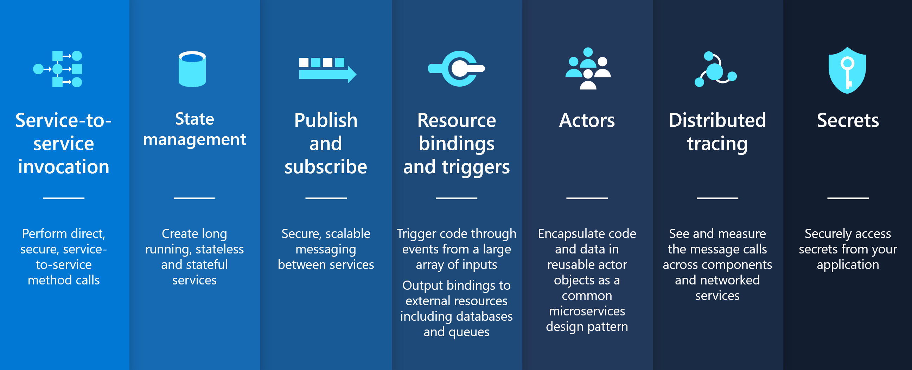

> 备注：内容来自 https://github.com/dapr/docs/tree/master/concepts

这些主题的目标是提供对Dapr文档中使用的关键概念的理解。

## 构建块/Building blocks

构建块以 HTTP 或 gRPC 方式提供API，可以从用户代码调用，构建块使用一个或多个 Dapr 组件。Dapr包含一系列构建块，并且具有可扩展性以添加新的构建块。

下图显示了构建块如何公开从代码中调用的公共API，使用组件实现构建块功能。

以下是Dapr提供的构建块：

| Building Block                                               | Endpoint                             | Description                                                  |
| ------------------------------------------------------------ | ------------------------------------ | ------------------------------------------------------------ |
| [**Service-to-Service Invocation**](https://github.com/dapr/docs/blob/master/concepts/service-invocation/README.md) | `/v1.0/invoke`                       | 服务调用使应用可以通过众所周知的端点以 http 或 gRPC 消息的形式相互通信。Dapr提供了一个端点，该端点充当反向代理与内置服务发现的结合，同时利用了内置分布式跟踪和错误处理。 |
| [**State Management**](https://github.com/dapr/docs/blob/master/concepts/state-management/README.md) | `/v1.0/state`                        | 应用状态是应用希望在单个会话之外保留的任何内容。Dapr提供了基于键/值的状态API，具有可插拔状态存储以实现持久性。 |
| [**Publish/Subscribe Messaging**](https://github.com/dapr/docs/blob/master/concepts/publish-subscribe-messaging/README.md) | `/v1.0/publish` /v1.0/subscribe | 发布/订阅是一种松散耦合的消息传递模式，发件人（或发布者）将消息发布到订阅者订阅的主题。 Dapr支持应用之间的发布/订阅模式。 |
| [**Resource Bindings**](https://github.com/dapr/docs/blob/master/concepts/bindings/README.md) | `/v1.0/bindings`                     | 绑定提供了到外部云/内部部署的服务或系统的双向连接。Dapr允许您通过Dapr绑定API调用外部服务，并允许应用被连接的服务发送的事件触发。 |
| [**Actors**](https://github.com/dapr/docs/blob/master/concepts/actors/README.md) | `/v1.0/actors`                       | Actor 是具有单线程执行的隔离，无依赖的计算和状态单元。Dapr提供了基于Virtual Actor模式的actor实现，该模式提供了单线程编程模型，并且在actor不使用时会对其进行垃圾回收。 |
| [**Observability**](https://github.com/dapr/docs/blob/master/concepts/observability/README.md) | `N/A`                                | Dapr系统组件和运行时发出metrics、日志和trace，以调试、运维和监控Dapr系统服务、组件和用户应用。 |
| [**Secrets**](https://github.com/dapr/docs/blob/master/concepts/secrets/README.md) | `/v1.0/secrets`                      | Dapr提供了一个秘密构件API，并与Azure Key Vault和Kubernetes等秘密存储集成来存储秘密。服务代码可以调用秘密API，从Dapr支持的秘密存储中检索秘密。 |

## 组件/Components

Dapr使用模块化设计，功能作为组件交付。每个组件都有一个接口定义。所有组件都是可插拔的，因此您可以将具有相同接口的一个组件换成另一个。组件contrib repo是你可以贡献组件接口和扩展Dapr功能的实现的地方。

构建块可以使用组件的任何组合。例如，Actor 构件块和状态管理构件块都使用状态组件。作为另一个示例，发布/订阅构建块使用 发布/订阅 组件。

您可以使用 `dapr components` CLI 命令获取当前主机环境中可用的组件列表。

以下是Dapr提供的组件类型：

- Service discovery / 服务发现
- State / 状态
- Pub/sub / 发布/订阅
- Bindings / 绑定
- Middleware / 中间件
- Secret store / 安全商店
- Tracing exporters / 追踪导出器

### 服务调用与服务发现组件

服务发现组件与服务调用构件一起使用，与托管环境集成，提供服务到服务的发现。例如，Kubernetes服务发现组件与kubernetes DNS服务集成，自托管使用mDNS。

### 服务调用与中间件组件

Dapr允许将自定义的中间件插入到请求处理管道中。中间件可以在请求上执行额外的操作，比如在请求被路由到用户代码之前，或者在请求被返回到客户端之前，进行认证、加密和消息转换。中间件组件与服务调用构件一起使用。

### Secrets存储组件

在Dapr中，“ Secret”是指任何你想防止不受欢迎的用户的私人信息。用于存储秘密的Secretstores是Dapr的组件，可以被任何一个构建块使用。

## 配置

Dapr 配置定义了一个策略，该策略会影响所有 Dapr sidecar 实例的行为，例如使用分布式跟踪或自定义管道。可以将配置动态地应用于Dapr Sidecar实例。

Dapr 配置定义了影响任意 Dapr  Sidecar实例行为方式的策略，例如使用分布式跟踪或中间件组件。配置可以动态地应用到Dapr sidecar实例。

您可以使用 dapr configuration CLI命令获取当前主机环境中可用的当前配置列表。

## 托管环境

Dapr 可以在多个托管平台上运行。支持的托管平台是：

- **自托管/Self hosted**： Dapr作为一个进程或在一个容器中在一台机器上运行。用于本地开发或在单机上运行
- **Kubernetes**：Dapr可在云提供商或本地的任何Kubernetes集群上运行。

