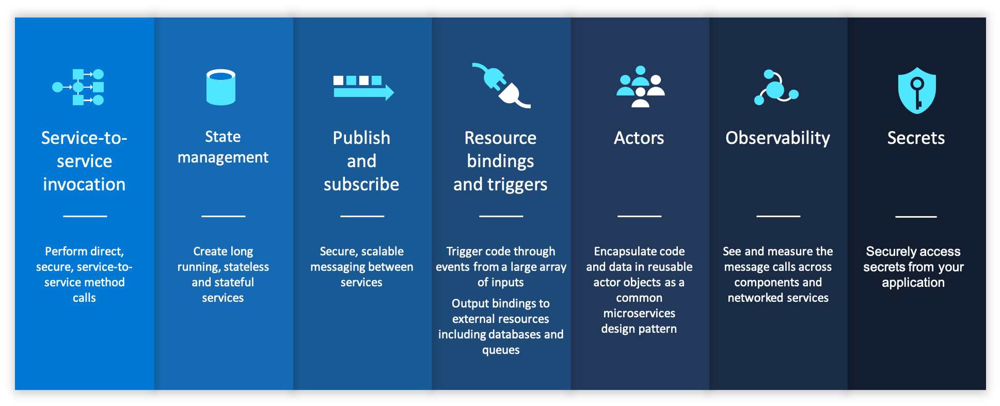
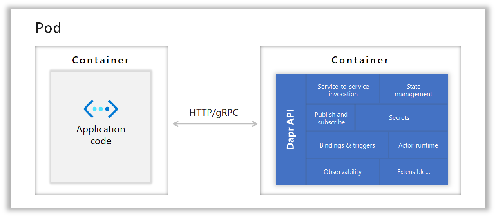

https://github.com/dapr/docs/tree/master/overview

Dapr是一个可移植的，由事件驱动的运行时，它使企业开发人员可以轻松构建弹性，微服务无状态和有状态应用, 这些应用在云和边缘上运行，并包含多种语言和开发框架。

### 任何语言，任何框架，任何地方

今天，我们正经历着上云的浪潮。开发人员熟练 Web+数据库应用架构（例如经典的3层设计），但对分布式的微服务应用架构则不熟悉。很难成为分布式系统专家，也不必这样做。开发人员希望专注于业务逻辑，同时依靠平台使他们的应用程序具有大规模，弹性，可维护性以及云原生架构的其他属性。

这就是Dapr的用武之地。Dapr 整理了构建微服务应用为开放，独立的构建块的最佳实践，使您能够使用自己选择的语言和框架来构建可移植的应用程序。 每个构建块都是独立的，您可以在应用中使用其中的一个或多个。

此外，Dapr与平台无关，这意味着您可以将应用运行在本地，在任何Kubernetes集群，以及与Dapr集成的其他托管环境中。这使您能够构建可在云和边缘上运行的微服务应用。

使用Dapr，您可以轻松地使用任何语言，任何框架来构建微服务应用程序，并在任何地方运行它们。

### 云和边缘的微服务构建块

在设计微服务应用时，有许多注意事项。在构建微服务应用时，Dapr为通用功能提供了最佳实践，开发人员可以以标准方式使用这些应用并部署应用到任何环境。通过提供分布式系统构建块来实现。

这些构建块中的每一个都是独立的，这意味着您可以在应用程序中使用其中的一个，部分或全部。在Dapr的初始版本中，提供了以下构建基块：

- **服务调用**：弹性的服务到服务调用，支持对远程服务的方法调用（包括重试） ，远程服务位于支持的托管环境中。
- **状态管理**：通过用于存储键/值对的状态管理，长期运行，高可用的有状态服务可以与应用中的无状态服务一起轻松地编写。状态存储是可插拔的，并且可以包括Azure CosmosDB，AWS DynamoDB或Redis。
- **发布和订阅消息**：发布事件和订阅主题
- **资源绑定**：在事件驱动的架构上，带有触发器的资源绑定通过从数据库，队列，文件系统等任何外部资源接收和发送事件来进一步构建规模和弹性。
- **Actors**：Actor是一种有状态和无状态对象的模式，通过方法和状态封装使并发变得简单。Dapr在其actor运行时中提供了许多功能，包括并发，状态，用于actor激活/停用的生命周期管理以及计时器和唤醒actor的提醒。
- **可观测性**：Dapr发出度量、日志和跟踪来调试和监控Dapr和用户应用。Dapr支持分布式跟踪，使用W3C Trace Context标准和Open Telemetry轻松诊断和服务于生产中的服务间调用，并发送给不同的监控工具。
- Secrets：Dapr提供秘密管理，并与公有云和本地秘密存储集成，以检索应用程序代码中使用的秘密。

### Sidecar架构

Dapr将其API作为Sidecar架构（容器或进程）暴露，不需要应用代码包含任何Dapr运行时代码。这使得其他运行时易于与Dapr的集成，并提供了应用逻辑的分离，从而提高了可支持性。

### 托管环境

Dapr可以托管在多种环境中，包括用于本地开发的自托管环境，或部署到一组虚拟机、Kubernetes和边缘环境（如Azure IoT Edge）。

#### 自托管环境

在自托管模式下，Dapr作为一个单独的sidecar进程运行，您的服务代码可以通过HTTP或gRPC调用。在自托管模式下，您也可以将Dapr部署到一组虚拟机上。

#### kubenetes托管环境

在Kubernetes之类的容器托管环境中，Dapr可以作为sidecar容器运行，和应用容器位于同一容器中。

### 开发人员编程语言SDK和框架

为了在不同的语言中使用Dapr更加自然，Dapr还包括针对Go，Java，JavaScript，.NET和Python的语言特定的SDK。这些SDK通过类型化的语言API（而不是调用http/gRPC API）公开了Dapr构建块中的功能，例如保存状态，发布事件或创建actor。这样，您就可以使用他们选择的语言来编写无状态/有状态的功能和Actor的组合。由于这些SDK共享Dapr运行时，因此您可以获得跨语言的actor和功能支持。

此外，Dapr可以与任何开发人员框架集成。例如，在Dapr .NET SDK中，您可以找到ASP.NET Core集成，该集成带来了有状态路由控制器，该控制器响应来自其他服务的发布/ 订阅事件。

#### SDKs

注意：Dapr是语言无关的，除了protobuf客户端之外，还提供了一个RESTful HTTP API。

#### Developer frameworks

##### Actors

Dapr SDK支持虚拟actor，虚拟actor是有状态的对象，使并发变得简单，具有方法和状态封装，是为可扩展的分布式应用而设计的。

##### Azure Functions

Dapr 通过扩展与 Azure Functions 运行时集成，使函数与 Dapr 无缝交互。Azure Functions 提供了一个事件驱动的编程模型，而 Dapr 则提供了云原生构件。通过该扩展，您可以将两者结合起来，用于无服务器和事件驱动的应用程序。有关更多信息，请阅读 Azure Functions extension for Dapr，并访问 Azure Functions extension repo 以试用样本。

##### Dapr workflows

为了使开发人员能够轻松构建使用Dapr功能（包括诊断和多语言支持）的工作流应用程序，您可以使用Dapr工作流。Dapr与工作流引擎（如Logic Apps）集成。如需了解更多信息，请阅读使用Dapr和Logic Apps的云原生工作流，并访问Dapr工作流资源库试用样本。

### 专为运维而设计

Dapr是为运维而设计的。通过Dapr CLI安装的服务仪表板提供了一个基于Web的用户界面，使您能够看到Dapr sidecar的信息、查看日志等。

监控仪表板提供了更深层次的Dapr系统服务和sidecar的可视性，Dapr的可观察性功能提供了对您的应用的洞察力，如跟踪和指标。

### 到处运行

#### 以自托管模式在本地开发人员计算机上运行Dapr

可以将Dapr配置为以自托管模式在开发人员本地机器上运行。每个运行的的服务都有一个Dapr运行时进程，该进程被配置为使用状态存储，发布/订阅，绑定组件和其他构造块。

您可以使用Dapr CLI在您的本地机器上运行一个启用Dapr的应用程序。

#### 在Kubernetes模式下运行Dapr

Dapr可以配置为在任何Kubernetes集群上运行。在Kubernetes中，dapr-sidecar-injector 和 dapr-operator 服务提供一流的集成，以将 Dapr 在与服务相同的pod中作为 sidecar 容器启动，并提供预配置到集群中的Dapr组件更新的通知。

dapr-sentry 服务是一个证书颁发机构，可启用Dapr Sidecar实例之间的双向TLS进行安全数据加密。有关该Sentry服务的更多信息，请阅读安全概述。

在Kubernetes集群中部署和运行一个启用了Dapr的应用程序很简单，只要在部署方案中添加一些注释即可。你可以在这里的Kubernetes入门样本中看到一些例子。

