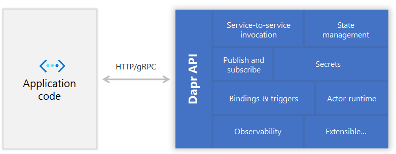
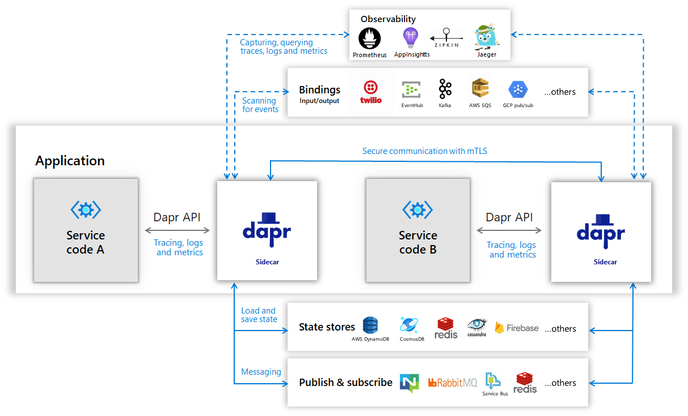
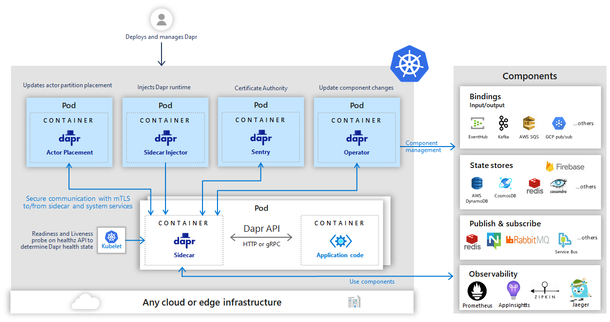

Dapr是一个可移植的，由事件驱动的运行时，它使企业开发人员可以轻松构建弹性，微服务无状态和有状态应用, 这些应用在云和边缘上运行，并包含多种语言和开发框架。

### 任何语言，任何框架，任何地方

今天，我们正经历着上云的浪潮。开发人员熟练 Web+数据库应用架构（例如经典的3层设计），但对分布式的微服务应用架构则不熟悉。很难成为分布式系统专家，也不必这样做。开发人员希望专注于业务逻辑，同时依靠平台使他们的应用程序具有大规模，弹性，可维护性以及云原生架构的其他属性。

这就是Dapr的用武之地。Dapr 整理了构建微服务应用为开放，独立的构建块的最佳实践，使您能够使用自己选择的语言和框架来构建可移植的应用程序。 每个构建块都是独立的，您可以在应用中使用其中的一个或多个。

此外，Dapr与平台无关，这意味着您可以将应用运行在本地，在任何Kubernetes集群，以及与Dapr集成的其他托管环境中。这使您能够构建可在云和边缘上运行的微服务应用。

使用Dapr，您可以轻松地使用任何语言，任何框架来构建微服务应用程序，并在任何地方运行它们。

### 云和边缘的微服务构建块

在设计微服务应用时，有许多注意事项。在构建微服务应用时，Dapr为通用功能提供了最佳实践，开发人员可以以标准方式使用这些应用并部署应用到任何环境。通过提供分布式系统构建块来实现。

这些构建块中的每一个都是独立的，这意味着您可以在应用程序中使用其中的一个，部分或全部。在Dapr的初始版本中，提供了以下构建基块：

- **服务调用**：弹性的服务到服务调用，支持对远程服务的方法调用（包括重试） ，远程服务位于支持的托管环境中。

- **状态管理**：通过用于存储键/值对的状态管理，长期运行，高可用的有状态服务可以与应用中的无状态服务一起轻松地编写。状态存储是可插拔的，并且可以包括Azure CosmosDB，AWS DynamoDB或Redis。

- **在服务之间发布和订阅消息**：在服务之间发布事件和订阅主题，事件驱动的架构可以简化水平可伸缩性并使其具有故障恢复能力。Dapr提供至少一次的消息传递保证。

- **事件驱动的资源绑定**：在事件驱动的架构上，带有触发器的资源绑定通过从数据库，队列，文件系统等任何外部资源接收和发送事件来进一步构建规模和弹性。

- **服务之间的分布式跟踪** Dapr支持使用W3C跟踪上下文标准在生产中轻松诊断和观察服务间调用的分布式跟踪。

- **Actors**：Actor是一种有状态和无状态对象的模式，通过方法和状态封装使并发变得简单。Dapr在其actor运行时中提供了许多功能，包括并发，状态，用于actor激活/停用的生命周期管理以及计时器和唤醒actor的提醒。

下图显示了Dapr提供的公开了标准API的分布式系统构建块。可以通过http或gRPC在任何开发人员代码中使用这些API。Dapr与任何托管平台（例如Kubernetes）集成，以实现跨云和边缘的应用可移植性。


### Sidecar架构

Dapr将其API作为Sidecar架构（容器或进程）暴露，不需要应用代码包含任何Dapr运行时代码。这使得其他运行时易于与Dapr的集成，并提供了应用逻辑的分离，从而提高了可支持性。



在Kubernetes之类的容器托管环境中，Dapr可以作为sidecar容器运行，和应用容器位于同一容器中。


### 开发人员编程语言SDK和框架

为了在不同的语言中使用Dapr更加自然，Dapr还包括针对Go，Java，JavaScript，.NET和Python的语言特定的SDK。这些SDK通过类型化的语言API（而不是调用http/gRPC API）公开了Dapr构建块中的功能，例如保存状态，发布事件或创建actor。这样，您就可以使用他们选择的语言来编写无状态/有状态的功能和Actor的组合。由于这些SDK共享Dapr运行时，因此您可以获得跨语言的actor和功能支持。

此外，Dapr可以与任何开发人员框架集成。例如，在Dapr .NET SDK中，您可以找到ASP.NET Core集成，该集成带来了有状态路由控制器，该控制器响应来自其他服务的发布/ 订阅事件。

### 以自托管模式在本地开发人员计算机上运行Dapr

可以将Dapr配置为以自托管模式在开发人员本地机器上运行。每个运行的的服务都有一个Dapr运行时进程，该进程被配置为使用状态存储，发布/订阅，绑定组件和其他构造块。

在自托管模式下，在容器中本地运行的Redis被默认安装为状态存储和pub/sub消息总线组件。

dapr-placement 服务负责管理 actor 分配方案和 key 范围设置。有关actor Placement服务的更多信息，请阅读actor概述。



### 在Kubernetes模式下运行Dapr

Dapr可以配置为在任何Kubernetes集群上运行。在Kubernetes中，dapr-sidecar-injector 和 dapr-operator 服务提供一流的集成，以将 Dapr 在与服务相同的pod中作为 sidecar 容器启动，并提供预配置到集群中的Dapr组件更新的通知。

dapr-sentry 服务是一个证书颁发机构，可启用Dapr Sidecar实例之间的双向TLS进行安全数据加密。有关该Sentry服务的更多信息，请阅读安全概述。



将支持Dapr的应用部署到kubernetes集群很简单，只需在 deployment 方案中添加一些 annotation 即可。要为服务提供可以为 Dapr 所知的ID和端口，请打开跟踪信息并启动 Dapr Sidecar容器，您需要在 deployment 中进行这样的注释。

```yml
  annotations:
    dapr.io/enabled: "true"
    dapr.io/id: "nodeapp"
    dapr.io/port: "3000"
    dapr.io/config: "tracing"
```
你可以看到一些例子这里在kubernetes入门指南。

