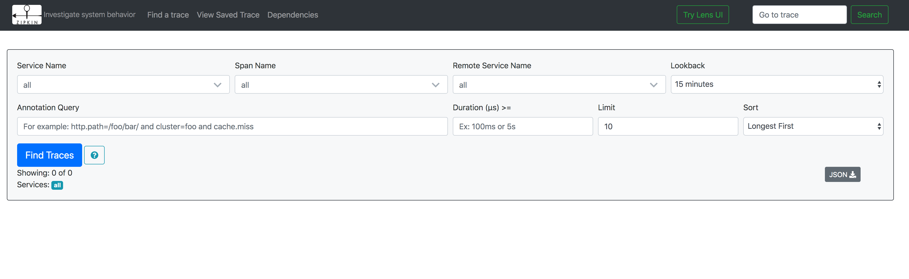

https://github.com/dapr/docs/blob/master/best-practices/troubleshooting/tracing.md

Dapr与Open Census集成，用于遥测和跟踪。

建议在任何生产场景下运行Dapr时启用跟踪。由于Dapr使用Open Census，您可以根据您的环境为跟踪和遥测数据配置各种导出器，无论是在云端还是在企业内部运行。

## 在Kubernetes上使用Zipkin进行分布式跟踪

以下步骤显示了如何配置Dapr将分布式跟踪数据发送到作为容器在Kubernetes集群中运行的Zipkin，以及如何查看它们。

### 部署

首先，部署Zipkin：

```bash
kubectl create deployment zipkin --image openzipkin/zipkin
```

为Zipkin pod创建一个Kubernetes服务：

```
kubectl expose deployment zipkin --type ClusterIP --port 9411
```

接下来，在本地创建以下YAML文件：

```yaml
apiVersion: dapr.io/v1alpha1
kind: Configuration
metadata:
  name: zipkin
  namespace: default
spec:
  tracing:
    enabled: true
    exporterType: zipkin
    exporterAddress: "http://zipkin.default.svc.cluster.local:9411/api/v2/spans"
    expandParams: true
    includeBody: true
```

最后，部署Dapr配置：

```
kubectl apply -f config.yaml
```

为了使您的Dapr sidecar能够开启这种配置，请将以下 annotation 添加到您的pod spec模板中。

```yaml
annotations:
  dapr.io/config: "zipkin"
```

这就对了！sidecar 现在已经配置好了，可以使用Open Census和Zipkin。

### 查看跟踪数据

要查看trace，请连接到Zipkin服务并打开用户界面。

```
kubectl port-forward svc/zipkin 9411:9411
```

在浏览器上，访问 http://localhost:9411，您应该可以看到Zipkin用户界面。



## 使用Zipkin的分布式追踪--独立模式

以下步骤显示了如何配置Dapr将分布式跟踪数据发送到本地机器上作为容器运行的Zipkin并查看它们。

对于单机模式，在本地创建一个Dapr配置文件，并通过Dapr CLI引用它。

1. 创建以下YAML文件。

	```yaml
	apiVersion: dapr.io/v1alpha1
	kind: Configuration
	metadata:
	  name: zipkin
	  namespace: default
	spec:
	  tracing:
	    enabled: true
	    exporterType: zipkin
	    exporterAddress: "http://localhost:9411/api/v2/spans"
	    expandParams: true
	    includeBody: true
	```

2. 使用Docker启动Zipkin

	```
	docker run -d -p 9411:9411 openzipkin/zipkin
	```

3. 用--config param启动Dapr

	```
	dapr run --app-id mynode --app-port 3000 --config ./config.yaml node app.js
	```

## 跟踪配置

Configuration 规范下的 tracing 部分包含以下属性：

```json
tracing:
    enabled: true
    exporterType: zipkin
    exporterAddress: ""
    expandParams: true
    includeBody: true
```

下表列出了不同的属性：

| Property        | Type   | Description                                                  |
| --------------- | ------ | ------------------------------------------------------------ |
| enabled         | bool   | Set tracing to be enabled or disabled                        |
| exporterType    | string | Name of the Open Census exporter to use. For example: Zipkin, Azure Monitor, etc |
| exporterAddress | string | URL of the exporter                                          |
| expandParams    | bool   | When true, expands parameters passed to HTTP endpoints       |
| includeBody     | bool   | When true, includes the request body in the tracing event    |


