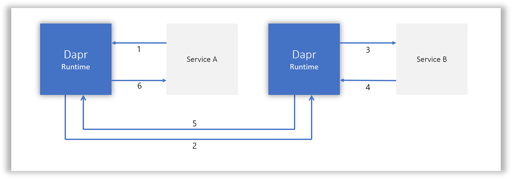

> 内容摘选自：https://github.com/dapr/docs/blob/master/concepts/service-invocation/service-invocation.md

启用Dapr的应用可以通过http或gRPC消息的形式的已知端点相互通信。

1. 服务A发起了针对服务B的http/gRPC调用。该调用转到本地的Dapr Sidecar。
2. Dapr发现服务B的位置，并将消息转发到服务B的Dapr sidecar
3. 服务B的Dapr sidecar将请求转发给服务B。服务B执行其相应的业务逻辑。
4. 服务B给服务A发送响应。该响应转到服务B的 sidecar。
5. Dapr将响应转发给Service A的Dapr边车。
6. 服务A收到响应。

作为上述所有内容的一个示例，假设我们具有以下示例中描述的应用集合，其中python应用程序调用Node.js应用：
https://github.com/dapr/samples/blob/master/2.hello-kubernetes/README.md

在这种情况下，python应用程序将是上面的“服务A”，而Node.js应用程序将是“服务B”。

下面描述了在此示例的上下文中的步骤1-6：

1. Suppose the Node.js app has a Dapr app id of "nodeapp", as in the sample.  The python app invokes the Node.js app's `neworder` method by posting `http://localhost:3500/v1.0/invoke/nodeapp/method/neworder`, which first goes to the python app's local Dapr sidecar.
2. Dapr discovers the Node.js app's location and forwards it to the Node.js app's sidecar.
3. The Node.js app's sidecar forwards the request to the Node.js app.  The Node.js app performs its business logic, which, as described in the sample, is to log the incoming message and then persist the order ID into Redis (not shown in the diagram above).

1. 像示例中一样，假设Node.js应用的 Dapr app id 为“ nodeapp”。python应用 neworder 通过发送 post 请求到 `http://localhost:3500/v1.0/invoke/nodeapp/method/neworder ` 来调用Node.js应用的 `neworder` 方法 ，该方法首先转到python应用的本地Dapr sidecar。

2. Dapr发现Node.js应用的位置，并将其转发到Node.js应用的 sidecar。
3. Node.js应用的 sidecar 将请求转发到Node.js应用。Node.js应用执行其业务逻辑，如示例中所述，该逻辑将记录传入消息，然后将订单ID持久保存到Redis（在上图中未显示）。

步骤4-5与上面的列表相同。

